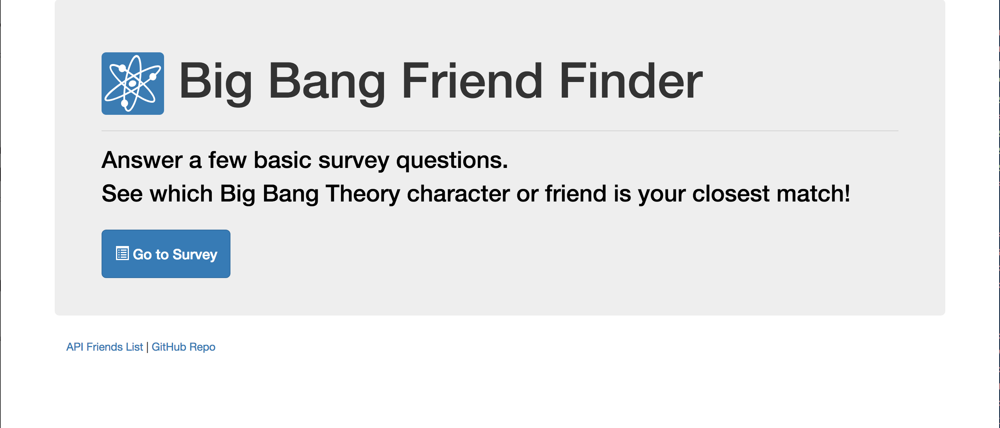
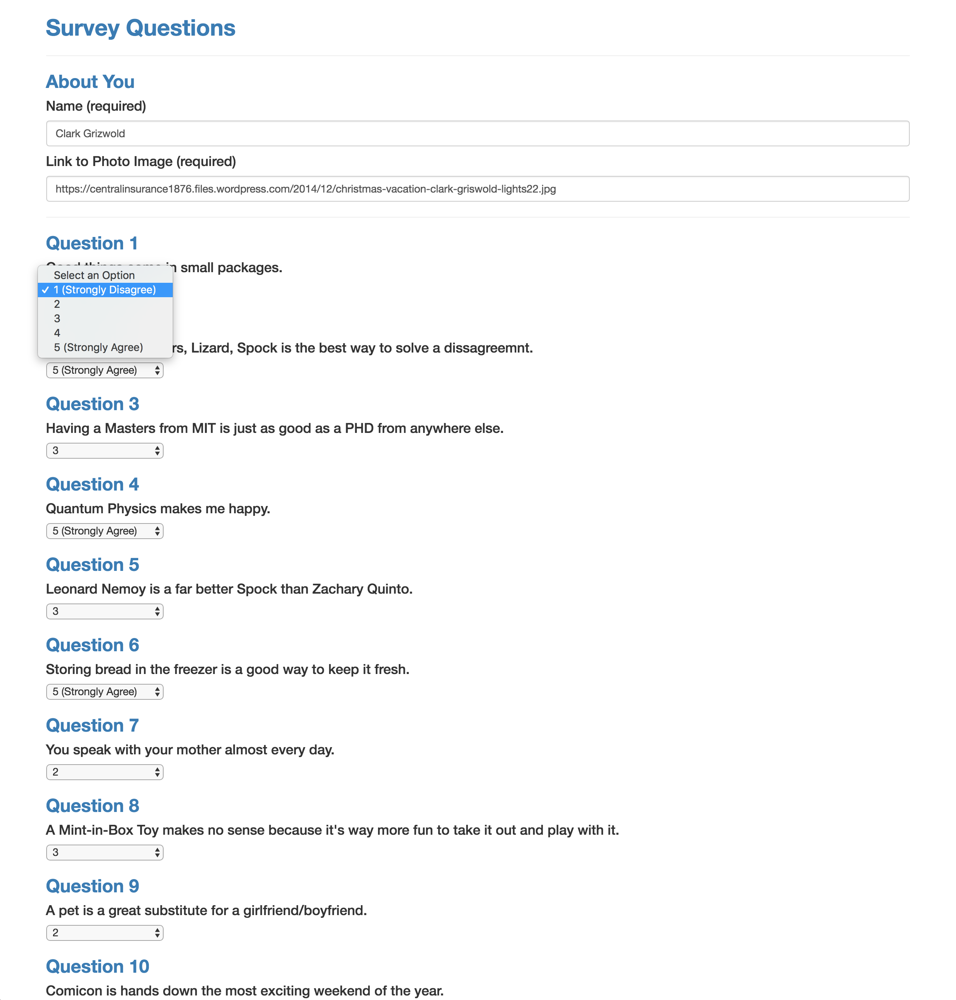
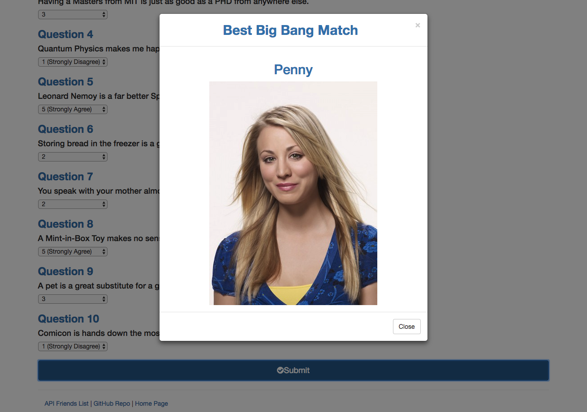

# Big Bang Theory Friend Finder
Homework #13: A compatibility-based "FriendFinder" application with a Big Bang Theory theme. This full-stack site takes in the results from user surveys, then compares their answers with those from other users. The app will then display the name and picture of the "friend" with the best overall match. Characters from the Big Bang Theory are included in the friends API and may also appear as a friend match.

## Technologies Used

* HTML
* CSS
* Javascript
* jQuery
* Node.js
* Express
* JSON
* GitHub
* Heroku

## Heroku Page Link

https://dry-castle-14318.herokuapp.com/

## Screenshots

### Home Page

### Survey Page

### Results Modal

### Friends Data API

